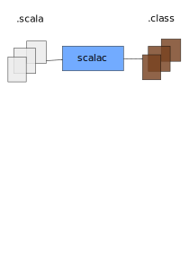
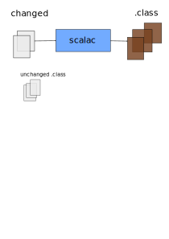
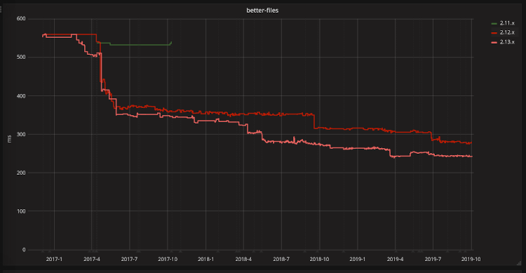
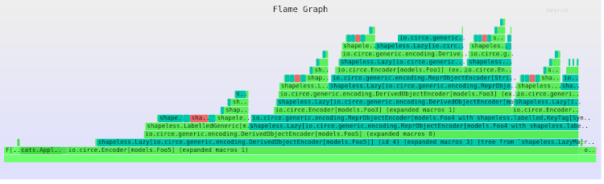

class: center, middle

# Run Scalac, Run

.center[Zainab Ali]

???

Twitter handle: @_zainab_ali_

---

background-image: url(assets/xkcd-compiling.png)


???

- This is a pretty common experience with large, legacy scala projects.
- Compilation is slow.
- It puts teams off scala
- It doesn't need to be the case

- What is happening when compile
- What we can do to speed it up

---

background-image: url(assets/bloop-trace.png)

???

- bloop let's us know the main tasks, and how long they take
- big task 'compile'
- calls something called 'zinc'
- calls 'scalac'

---

# What is scalac?



???

- the scala compiler
- takes input sources, dependencies, generates java byte code
- written in scala
- runs on the JVM
- your build server feeds and starts it
- bytecode in target
- cleaning deletes stored bytecode
- clean and compile a few times...

---

background-image: url(assets/warm.png)

---

# JIT Compilation


???

- scala runs on JVM
- interpreter
- runs java byte code of scalac in process
- when a function within scalac is called a certain number of times, generates assembly code and calls that instead
- calling and running assembly code is faster than interpreting java byte code
- Just In Time compilation (or JIT)
- repeatedly clean compile, call same scalac functions
- JVM converts more to assembly code -> warming up
- same JVM runs scalac application each time
- build servers depend on zinc, which uses Nailgun to do this

---

# Incremental compile




???

- do not repeatedly clean and compile when editing code
- change a single source file, don't throw away the bytecode of all other sources
- only recompile my file, and upstream files
- incremental compilation - set of changed files as inputs
- build server builds a graph of all the files in your project
- your build server will use incremental compile by default, so it's something you use without knowing
- ? the first compile is slightly slower, as it needs to analyse - one thing you might want to do is turn this off in CI

---

class: center

# Speeding things up

## do less work
## do it in parallel
## do it bettter

???

- these can be applied to any process
- do less work
- do it in parallel
- do it better

---

# Delete your code


???

- Tell you a bit more about the legacy code project
- It's this big mono repo - there's just one project
- We have this playground package which noone uses
- Scalac will compile your code even if it's unused
- Scalac is not sophisticated enough to know which parts of your code are unused
- large codebase has large swathes of unused code
- This is the biggest thing you can do
- ScalaClean project (Rory).  Help you find the parts which might be deletable.

---

# Split up your codebase 


???

- It's this big mono repo
- I have some packages, models, services and ml
- Everything uses these models, but serveces and ml aren't dependent on each other
- Scalac should be able to compile these in parallel
- It's not as sophisticated as that
- But your build server is, with a bit of prompting

---

# Split up your codebase 

```scala
lazy val models = (project in file("models"))

lazy val services = (project in file("services"))
.dependsOn(models)

lazy val ml = (project in file("ml"))
.dependsOn(models)

lazy val root = (project in file("."))
.aggregate(models, services, ml)
```

???


- I'm going to split this up into multiple projects
- Let's see what bloop is doing

Your build tool, on the other hand can do so with a bit of direction.  If you split your code up into multiple modules, your build tool will run a separate scalac process for each module.  Those are run in parallel.

Some build tools, like bloop are even smarter.  They make use of a feature called build pipelining.

(2 minutes)

---


background-image: url(assets/multi-project.png)

???

- Bloop runs a separate scalac process for each module
- The two modules are compiled at the same time
- The total time of my build is sped up

- Not only that, do you notice that one starts before the other has finished?
- This is a feature called pipelining
- The ser, ml don't need to know the java bytecode - just the intermediate representation

---

# Upgrade Scala



https://scala-ci.typesafe.com/grafana/dashboard/db/scala-benchmark

???

- What about making scalac faster itself?
- Each release of the scala compiler bings performance improvements 
- This is a benchmark of compilation times for different scala versions
- The red line is 2.12, and the pink is 2.13
- For this project, 2.13 is significantly faster.
- You can make use of these by upgrading your scala version
- Difficult to do if you have a large, badly structured codebase 
- Breaking it into multiple projects and removing dead code might help first

---

# Tweak the JVM


???
- Scalac functional code is has specific characteristics - many small functions, and large small objects
- Escape analysis and inlining
- Graal is an alternative JVM that tends to be better at running scalac, because these are better
- It allocates fewer objects when running scalac
- Graal has a community edition
- Even tweak your own JVM options
- e.g MaxInlineLevel

---

# So far...

|               | Time (s) | Improvement (s) |
|---------------|----------|----------------|
| Cold JVM      | 59       |                |
| Warm          | 40       | 19             |
| Code deletion | 31       | 9              |
| Multi project | 23       | 8              |
| Upgrades      | 18       | 4              |

???

 - 1/3rd what it was initially
 - warming up JVM
 - code deletion most significant
 - if still slow
 - sometimes we might need to make more complex changes
 - understand scala compiler
 - how might we do that?

---

# The Scala compiler

```scala
scalacOptions += "-Ystatistics"
```


???


 - 13 phases, complex names
 - 3 main parts
 - parsing generates a syntax tree
 - typer typechecks
 - everything else related to byte generation
 - problem is usually the typer
 - worry when 70+%

---

# The typer : elaboration

- resolve types
- resolve terms
- implicit searches

```scala
import even.more.implicits._

val num: Int = 42
val bar = num.magic

implicit def magicConversion(val num: Int): Foo = ...
implicit def anotherMagicConversion(val num: Int): Bar = ...
```

???

 - Why is the typer slow?
 - difficult job

The typer has a difficult job.  It needs to work out all the types, work out all the functions you're calling, and perform implicit searches.  This is especially difficult if you have a lot of implicit conversions.  Typelevel induction, heavily used in shapeless, can also be pretty intense on the typer.  The typer has to perform a search for all the implicits in scope.

The typer needs to:
- work out all the types
- work out the function you're calling on the type
- let's say your code has a bunch of implicit conversions, this becomes quite difficult
- search for all the implicits that you're calling.  Only then do we know that this call is valid, and we can work out the type of bar.

Large levels of implicit induction can cause the typer to slow down.

How do we identify these pain points in the typer?

---

# Profiling the typer

```scala
addCompilerPlugin("ch.epfl.scala" %% "scalac-profiling" % "1.0.0")
```




---

# Implicit derivation

```scala
import io.circe.generic.auto._

def routes: HttpRoutes[F] = {
HttpRoutes.of[F] {
case GET -> Root / "hello" / name =>
Ok(foo) // automatic generic derivation
}
}
```

---

# Implicit derivation

```scala
import io.circe._, io.circe.generic.semiauto._

final case class Foo5(name: Foo4, fre: Foo3, sdf: Foo3)

object Foo5 {
implicit val foo5Encoder: Encoder[Foo5] = deriveEncoder[Foo5]
}
```


---

# There is hope!

- Scalac is simple
- Scalac can be fast
- Simple fixes have large gains

---

# Try it yourself

- [London Scala User Group workshop](https://lsug.github.io/workshop/scala/2019/07/21/workshop-run-scalac-run.html)
- [Bloop performance guide](https://scalacenter.github.io/bloop/docs/performance-guide)
- [Speeding up compilation times with scalac-profiling](https://www.scala-lang.org/blog/2018/06/04/scalac-profiling.html)
- [ScalaClean](https://github.com/rorygraves/ScalaClean)
- [GraalVM](https://www.graalvm.org/)

---

# Thank you!


